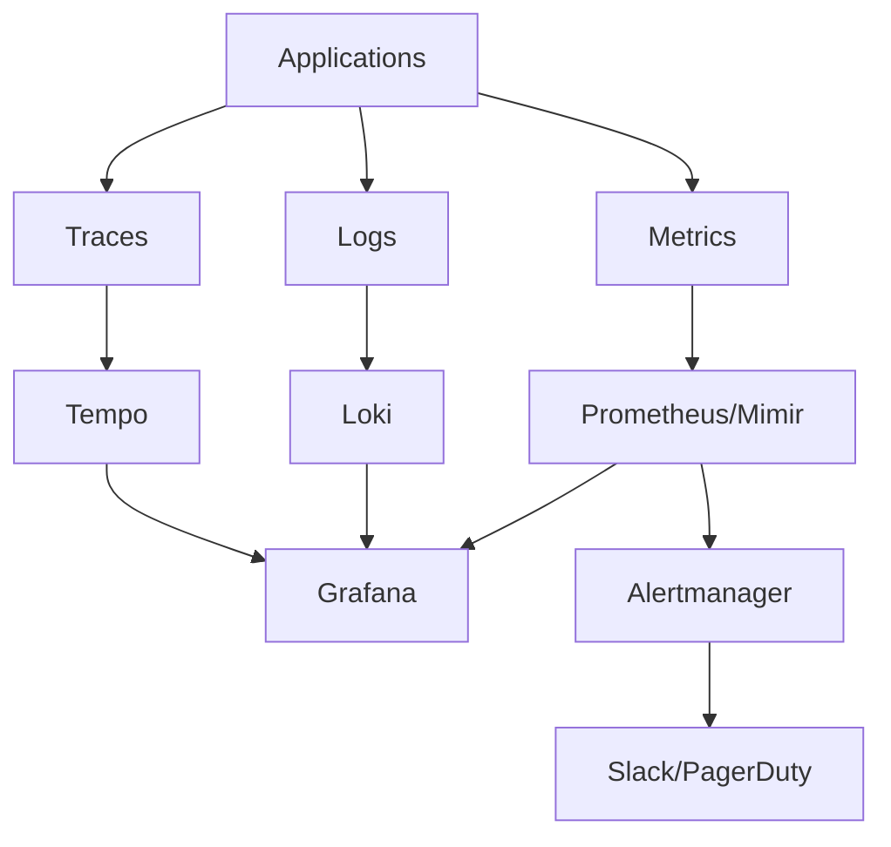

# Complete Monitoring Setup Guide

## 🎯 Monitoring Architecture Overview

### Three-Pillar Observability


### Monitoring Stack Components
```
Monitoring Stack
├── Data Collection
│   ├── Prometheus Agent      # Metrics scraping
│   ├── Fluent Bit           # Log collection
│   ├── OpenTelemetry        # Trace collection
│   └── Exporters            # Database/service metrics
├── Data Storage
│   ├── Mimir               # Long-term metrics storage
│   ├── Loki                # Log aggregation
│   └── Tempo               # Trace storage
├── Visualization
│   └── Grafana             # Dashboards and alerts
├── Alerting
│   ├── Alertmanager        # Alert routing
│   └── Notification        # Slack, PagerDuty, Email
└── Security
    ├── RBAC                # Role-based access
    └── TLS                 # Encrypted communication
```

## 🚀 Step-by-Step Implementation

### Phase 1: Infrastructure Setup

#### 1.1 Deploy Monitoring Infrastructure
```bash
# Deploy monitoring stack to devops cluster
kubectl apply -f charts/mimir/
kubectl apply -f charts/loki/
kubectl apply -f charts/tempo/
kubectl apply -f charts/grafana/

# Verify deployment
kubectl get pods -n monitoring
```

#### 1.2 Configure Storage Backends
```yaml
# AWS S3 Configuration
mimir:
  storage:
    backend: s3
    s3:
      bucket: mimir-metrics-prod
      region: us-west-2
      
loki:
  storage:
    backend: s3
    s3:
      bucket: loki-logs-prod
      region: us-west-2
      
tempo:
  storage:
    backend: s3
    s3:
      bucket: tempo-traces-prod
      region: us-west-2
```

#### 1.3 Setup Multi-Tenancy
```yaml
# Tenant Configuration
tenants:
  - name: devops
    id: _devops
    limits:
      ingestion_rate: 100MB/s
      max_series: 1000000
      
  - name: applications
    id: _apps
    limits:
      ingestion_rate: 500MB/s
      max_series: 5000000
```

### Phase 2: Application Monitoring

#### 2.1 Instrument Applications
```java
// Backend - Spring Boot with OpenTelemetry
@RestController
public class UserController {
    
    private final MeterRegistry meterRegistry;
    private final Tracer tracer;
    
    @GetMapping("/users")
    @Timed(name = "users.get", description = "Time taken to get users")
    public List<User> getUsers() {
        Span span = tracer.nextSpan().name("get-users").start();
        try {
            meterRegistry.counter("users.requests", "endpoint", "get").increment();
            return userService.getAllUsers();
        } finally {
            span.end();
        }
    }
}
```

```javascript
// Frontend - React with OpenTelemetry
import { trace, metrics } from '@opentelemetry/api';

const tracer = trace.getTracer('frontend');
const meter = metrics.getMeter('frontend');
const requestCounter = meter.createCounter('http_requests_total');

function ApiService() {
  const fetchUsers = async () => {
    const span = tracer.startSpan('fetch-users');
    requestCounter.add(1, { endpoint: '/api/users' });
    
    try {
      const response = await fetch('/api/users');
      span.setAttributes({ 
        'http.status_code': response.status,
        'http.method': 'GET' 
      });
      return response.json();
    } finally {
      span.end();
    }
  };
}
```

#### 2.2 Deploy Monitoring Agents
```yaml
# Prometheus Agent Configuration
apiVersion: v1
kind: ConfigMap
metadata:
  name: prometheus-config
data:
  prometheus.yml: |
    global:
      scrape_interval: 30s
      external_labels:
        cluster: application-cluster
        tenant: _apps
    
    scrape_configs:
    - job_name: 'kubernetes-pods'
      kubernetes_sd_configs:
      - role: pod
      relabel_configs:
      - source_labels: [__meta_kubernetes_pod_annotation_prometheus_io_scrape]
        action: keep
        regex: true
      - source_labels: [__meta_kubernetes_pod_annotation_prometheus_io_path]
        action: replace
        target_label: __metrics_path__
        regex: (.+)
    
    remote_write:
    - url: https://mimir.company.com/api/v1/push
      basic_auth:
        username: observe
        password: ${MIMIR_PASSWORD}
      headers:
        X-Scope-OrgID: _apps
```

#### 2.3 Configure Log Collection
```yaml
# Fluent Bit Configuration
apiVersion: v1
kind: ConfigMap
metadata:
  name: fluent-bit-config
data:
  fluent-bit.conf: |
    [SERVICE]
        Flush         1
        Log_Level     info
        Daemon        off
        Parsers_File  parsers.conf

    [INPUT]
        Name              tail
        Path              /var/log/containers/*.log
        Parser            docker
        Tag               kube.*
        Refresh_Interval  5
        Mem_Buf_Limit     50MB

    [FILTER]
        Name                kubernetes
        Match               kube.*
        Kube_URL            https://kubernetes.default.svc:443
        Kube_CA_File        /var/run/secrets/kubernetes.io/serviceaccount/ca.crt
        Kube_Token_File     /var/run/secrets/kubernetes.io/serviceaccount/token
        Merge_Log           On
        K8S-Logging.Parser  On

    [OUTPUT]
        Name                 loki
        Match                *
        Host                 loki.company.com
        Port                 443
        TLS                  On
        Labels               job=fluent-bit, cluster=application-cluster
        Auto_Kubernetes_Labels on
        HTTP_User            observe
        HTTP_Passwd          ${LOKI_PASSWORD}
        Tenant_ID            _apps
```

### Phase 3: Alerting Configuration

#### 3.1 Define Alert Rules
```yaml
# Application Alert Rules
groups:
- name: application.rules
  rules:
  - alert: HighErrorRate
    expr: |
      (
        rate(http_requests_total{status=~"5.."}[5m]) / 
        rate(http_requests_total[5m])
      ) > 0.05
    for: 5m
    labels:
      severity: warning
      team: backend
    annotations:
      summary: "High error rate detected"
      description: "Error rate is {{ $value | humanizePercentage }} for {{ $labels.service }}"
      runbook_url: "https://runbooks.company.com/high-error-rate"
      
  - alert: HighLatency
    expr: |
      histogram_quantile(0.95, 
        rate(http_request_duration_seconds_bucket[5m])
      ) > 2
    for: 10m
    labels:
      severity: warning
      team: backend
    annotations:
      summary: "High latency detected"
      description: "95th percentile latency is {{ $value }}s for {{ $labels.service }}"
      
  - alert: ServiceDown
    expr: up{job=~"frontend|backend"} == 0
    for: 2m
    labels:
      severity: critical
      team: platform
    annotations:
      summary: "Service is down"
      description: "{{ $labels.job }} service has been down for more than 2 minutes"
```

#### 3.2 Configure Alert Routing
```yaml
# Alertmanager Configuration
global:
  slack_api_url: 'https://hooks.slack.com/services/YOUR/SLACK/WEBHOOK'

route:
  group_by: ['alertname', 'cluster', 'service']
  group_wait: 10s
  group_interval: 5m
  repeat_interval: 1h
  receiver: 'default'
  routes:
  - matchers:
    - severity=critical
    - team=platform
    receiver: platform-critical
    continue: true
  - matchers:
    - severity=warning
    - team=backend
    receiver: backend-team
  - matchers:
    - severity=critical
    - team=frontend
    receiver: frontend-team

receivers:
- name: 'default'
  
- name: platform-critical
  slack_configs:
  - channel: '#platform-critical'
    title: '🔥 CRITICAL ALERT'
    text: |
      *Alert:* {{ range .Alerts }}{{ .Annotations.summary }}{{ end }}
      *Description:* {{ range .Alerts }}{{ .Annotations.description }}{{ end }}
      *Runbook:* {{ range .Alerts }}{{ .Annotations.runbook_url }}{{ end }}
  pagerduty_configs:
  - routing_key: YOUR_PAGERDUTY_KEY
    description: "{{ range .Alerts }}{{ .Annotations.summary }}{{ end }}"
    
- name: backend-team
  slack_configs:
  - channel: '#backend-alerts'
    title: '⚠️ Backend Alert'
    text: |
      *Service:* {{ .CommonLabels.service }}
      *Alert:* {{ range .Alerts }}{{ .Annotations.summary }}{{ end }}
```

### Phase 4: Dashboard Creation

#### 4.1 Application Performance Dashboard
```json
{
  "dashboard": {
    "title": "Application Performance Monitoring",
    "panels": [
      {
        "title": "Request Rate",
        "type": "graph",
        "targets": [
          {
            "expr": "sum(rate(http_requests_total[5m])) by (service)",
            "legendFormat": "{{service}}"
          }
        ]
      },
      {
        "title": "Error Rate",
        "type": "graph", 
        "targets": [
          {
            "expr": "sum(rate(http_requests_total{status=~\"5..\"}[5m])) by (service) / sum(rate(http_requests_total[5m])) by (service)",
            "legendFormat": "{{service}} errors"
          }
        ]
      },
      {
        "title": "Response Time",
        "type": "graph",
        "targets": [
          {
            "expr": "histogram_quantile(0.95, sum(rate(http_request_duration_seconds_bucket[5m])) by (le, service))",
            "legendFormat": "{{service}} p95"
          },
          {
            "expr": "histogram_quantile(0.50, sum(rate(http_request_duration_seconds_bucket[5m])) by (le, service))",
            "legendFormat": "{{service}} p50"
          }
        ]
      }
    ]
  }
}
```

#### 4.2 Infrastructure Dashboard
```json
{
  "dashboard": {
    "title": "Infrastructure Monitoring",
    "panels": [
      {
        "title": "CPU Usage",
        "type": "graph",
        "targets": [
          {
            "expr": "100 - (avg by (instance) (rate(node_cpu_seconds_total{mode=\"idle\"}[5m])) * 100)",
            "legendFormat": "{{instance}}"
          }
        ]
      },
      {
        "title": "Memory Usage", 
        "type": "graph",
        "targets": [
          {
            "expr": "(1 - (node_memory_MemAvailable_bytes / node_memory_MemTotal_bytes)) * 100",
            "legendFormat": "{{instance}}"
          }
        ]
      },
      {
        "title": "Disk Usage",
        "type": "graph",
        "targets": [
          {
            "expr": "100 - ((node_filesystem_avail_bytes / node_filesystem_size_bytes) * 100)",
            "legendFormat": "{{instance}} - {{mountpoint}}"
          }
        ]
      }
    ]
  }
}
```

### Phase 5: Advanced Monitoring

#### 5.1 SLI/SLO Configuration
```yaml
# Service Level Objectives
apiVersion: sloth.slok.dev/v1
kind: PrometheusServiceLevel
metadata:
  name: frontend-slo
spec:
  service: "frontend"
  labels:
    team: "frontend"
  slos:
  - name: "requests-availability"
    objective: 99.9
    description: "99.9% of requests should be successful"
    sli:
      events:
        error_query: sum(rate(http_requests_total{job="frontend",code=~"5.."}[5m]))
        total_query: sum(rate(http_requests_total{job="frontend"}[5m]))
    alerting:
      name: "FrontendHighErrorRate"
      labels:
        severity: "critical"
      annotations:
        summary: "Frontend SLO error rate is too high"
        
  - name: "requests-latency"
    objective: 95.0
    description: "95% of requests should be faster than 500ms"
    sli:
      events:
        error_query: sum(rate(http_request_duration_seconds_bucket{job="frontend",le="0.5"}[5m]))
        total_query: sum(rate(http_request_duration_seconds_count{job="frontend"}[5m]))
```

#### 5.2 Custom Metrics and Exporters
```go
// Custom Exporter Example
package main

import (
    "github.com/prometheus/client_golang/prometheus"
    "github.com/prometheus/client_golang/prometheus/promhttp"
)

var (
    businessMetric = prometheus.NewGaugeVec(
        prometheus.GaugeOpts{
            Name: "business_orders_total",
            Help: "Total number of orders processed",
        },
        []string{"status", "region"},
    )
)

func init() {
    prometheus.MustRegister(businessMetric)
}

func updateBusinessMetrics() {
    // Update metrics from database
    orders := getOrdersFromDB()
    for region, count := range orders {
        businessMetric.WithLabelValues("completed", region).Set(float64(count))
    }
}
```

#### 5.3 Distributed Tracing Setup
```yaml
# OpenTelemetry Collector Configuration
apiVersion: v1
kind: ConfigMap
metadata:
  name: otel-collector-config
data:
  otel-config.yaml: |
    receivers:
      otlp:
        protocols:
          grpc:
            endpoint: 0.0.0.0:4317
          http:
            endpoint: 0.0.0.0:4318
      jaeger:
        protocols:
          grpc:
            endpoint: 0.0.0.0:14250
          thrift_http:
            endpoint: 0.0.0.0:14268
    
    processors:
      batch:
        timeout: 1s
        send_batch_size: 1024
      resource:
        attributes:
        - key: service.name
          from_attribute: service_name
          action: insert
        - key: cluster
          value: application-cluster
          action: insert
    
    exporters:
      otlp:
        endpoint: https://tempo.company.com:443
        headers:
          authorization: "Basic ${TEMPO_AUTH}"
          x-scope-orgid: "_apps"
        tls:
          insecure: false
      logging:
        loglevel: debug
    
    service:
      pipelines:
        traces:
          receivers: [otlp, jaeger]
          processors: [batch, resource]
          exporters: [otlp, logging]
```

## 📊 Monitoring Automation

### Auto-Discovery and Onboarding
```bash
#!/bin/bash
# scripts/auto-discover-services.sh

# Discover new services in Kubernetes
NEW_SERVICES=$(kubectl get services --all-namespaces -o json | \
  jq -r '.items[] | select(.metadata.annotations."prometheus.io/scrape" == "true") | 
  .metadata.namespace + "/" + .metadata.name')

for service in $NEW_SERVICES; do
  namespace=$(echo $service | cut -d'/' -f1)
  name=$(echo $service | cut -d'/' -f2)
  
  # Check if monitoring already exists
  if ! grep -q "$name" monitoring/apps/*.yaml; then
    echo "Onboarding new service: $service"
    
    # Generate monitoring configuration
    envsubst < templates/service-monitoring.yaml > monitoring/apps/${name}.yaml
    
    # Generate alert rules
    envsubst < templates/service-alerts.yaml > alerts/apps/${name}.yaml
    
    # Generate dashboard
    envsubst < templates/service-dashboard.json > dashboards/apps/${name}.json
    
    # Commit changes
    git add monitoring/apps/${name}.yaml alerts/apps/${name}.yaml dashboards/apps/${name}.json
    git commit -m "Auto-onboard service: $service"
  fi
done
```

### Health Check Automation
```yaml
# .github/workflows/monitoring-health.yml
name: Monitoring Health Check
on:
  schedule:
    - cron: '*/15 * * * *'  # Every 15 minutes

jobs:
  health-check:
    runs-on: ubuntu-latest
    steps:
      - name: Check Prometheus
        run: |
          curl -f "${{ secrets.PROMETHEUS_URL }}/api/v1/query?query=up" || exit 1
          
      - name: Check Grafana
        run: |
          curl -f "${{ secrets.GRAFANA_URL }}/api/health" || exit 1
          
      - name: Check Alert Rules
        run: |
          curl -f "${{ secrets.PROMETHEUS_URL }}/api/v1/rules" | \
          jq '.data.groups[].rules[] | select(.health != "ok")' | \
          if [ -s /dev/stdin ]; then exit 1; fi
          
      - name: Notify on Failure
        if: failure()
        run: |
          curl -X POST "${{ secrets.SLACK_WEBHOOK }}" \
            -d '{"text": "🚨 Monitoring stack health check failed!"}'
```

This comprehensive monitoring setup provides **complete observability** with automated onboarding, alerting, and health monitoring for your entire infrastructure and applications!