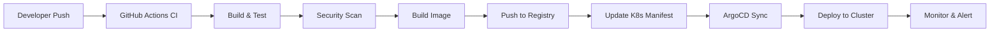
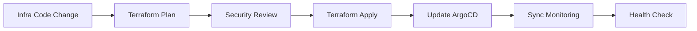

# Workflow Automation - Complete CI/CD Pipeline

## 🔄 End-to-End Automation Flow

### Developer Workflow


### Infrastructure Workflow


## 🚀 GitHub Actions Workflows

### 1. Application CI/CD Pipeline

#### CI Pipeline (`ci.yml`)
```yaml
name: Continuous Integration
on:
  push:
    branches: [main, develop]
  pull_request:
    branches: [main]

jobs:
  test:
    runs-on: ubuntu-latest
    steps:
      - uses: actions/checkout@v4
      
      - name: Setup Environment
        uses: ./.github/actions/setup-env
        
      - name: Run Tests
        run: |
          npm test                    # Frontend
          mvn test                    # Backend
          
      - name: Code Coverage
        uses: codecov/codecov-action@v3
        
  security:
    runs-on: ubuntu-latest
    steps:
      - uses: actions/checkout@v4
      
      - name: Security Scan
        uses: github/super-linter@v4
        
      - name: Dependency Check
        run: |
          npm audit                   # Frontend
          mvn dependency-check:check  # Backend
          
      - name: Container Scan
        uses: aquasecurity/trivy-action@master
        
  build:
    needs: [test, security]
    runs-on: ubuntu-latest
    outputs:
      image-tag: ${{ steps.meta.outputs.tags }}
    steps:
      - uses: actions/checkout@v4
      
      - name: Docker Meta
        id: meta
        uses: docker/metadata-action@v4
        with:
          images: ${{ secrets.REGISTRY_URL }}/${{ github.repository }}
          
      - name: Build and Push
        uses: docker/build-push-action@v4
        with:
          push: true
          tags: ${{ steps.meta.outputs.tags }}
          
  deploy-staging:
    needs: build
    if: github.ref == 'refs/heads/develop'
    runs-on: ubuntu-latest
    steps:
      - name: Update Staging Manifest
        run: |
          # Update image tag in staging overlay
          yq e '.images[0].newTag = "${{ needs.build.outputs.image-tag }}"' -i k8s/overlays/staging/kustomization.yaml
          
      - name: Commit Changes
        run: |
          git config --local user.email "action@github.com"
          git config --local user.name "GitHub Action"
          git add k8s/overlays/staging/
          git commit -m "Update staging image to ${{ needs.build.outputs.image-tag }}"
          git push
```

#### CD Pipeline (`cd.yml`)
```yaml
name: Continuous Deployment
on:
  push:
    branches: [main]
    paths: ['k8s/**']

jobs:
  deploy-production:
    runs-on: ubuntu-latest
    environment: production
    steps:
      - uses: actions/checkout@v4
      
      - name: Validate Manifests
        run: |
          kubeval k8s/overlays/production/*.yaml
          
      - name: Security Policy Check
        run: |
          conftest verify --policy policies/ k8s/overlays/production/
          
      - name: Update Production Manifest
        run: |
          # Get latest tested image from staging
          STAGING_IMAGE=$(yq e '.images[0].newTag' k8s/overlays/staging/kustomization.yaml)
          yq e '.images[0].newTag = "'$STAGING_IMAGE'"' -i k8s/overlays/production/kustomization.yaml
          
      - name: Commit Production Update
        run: |
          git config --local user.email "action@github.com"
          git config --local user.name "GitHub Action"
          git add k8s/overlays/production/
          git commit -m "Deploy to production: $STAGING_IMAGE"
          git push
          
      - name: Notify ArgoCD
        run: |
          curl -X POST "${{ secrets.ARGOCD_WEBHOOK_URL }}" \
            -H "Authorization: Bearer ${{ secrets.ARGOCD_TOKEN }}" \
            -d '{"repository": "${{ github.repository }}"}'
```

### 2. Infrastructure Pipeline

#### Infrastructure CI/CD (`infrastructure.yml`)
```yaml
name: Infrastructure Deployment
on:
  push:
    paths: ['infrastructure/**']
    branches: [main]
  pull_request:
    paths: ['infrastructure/**']

jobs:
  plan:
    runs-on: ubuntu-latest
    strategy:
      matrix:
        cloud: [aws, azure, gcp]
    steps:
      - uses: actions/checkout@v4
      
      - name: Setup Terraform
        uses: hashicorp/setup-terraform@v2
        
      - name: Configure Cloud Credentials
        run: |
          case "${{ matrix.cloud }}" in
            aws)
              export AWS_ACCESS_KEY_ID="${{ secrets.AWS_ACCESS_KEY_ID }}"
              export AWS_SECRET_ACCESS_KEY="${{ secrets.AWS_SECRET_ACCESS_KEY }}"
              ;;
            azure)
              echo '${{ secrets.AZURE_CREDENTIALS }}' | base64 -d > azure-creds.json
              export ARM_CLIENT_ID=$(jq -r .clientId azure-creds.json)
              export ARM_CLIENT_SECRET=$(jq -r .clientSecret azure-creds.json)
              export ARM_SUBSCRIPTION_ID=$(jq -r .subscriptionId azure-creds.json)
              export ARM_TENANT_ID=$(jq -r .tenantId azure-creds.json)
              ;;
            gcp)
              echo '${{ secrets.GCP_SA_KEY }}' | base64 -d > gcp-creds.json
              export GOOGLE_APPLICATION_CREDENTIALS=gcp-creds.json
              ;;
          esac
          
      - name: Terraform Plan
        run: |
          cd infrastructure/${{ matrix.cloud }}
          terraform init
          terraform plan -out=tfplan
          
      - name: Upload Plan
        uses: actions/upload-artifact@v3
        with:
          name: tfplan-${{ matrix.cloud }}
          path: infrastructure/${{ matrix.cloud }}/tfplan
          
  apply:
    needs: plan
    if: github.ref == 'refs/heads/main'
    runs-on: ubuntu-latest
    environment: production
    strategy:
      matrix:
        cloud: [aws, azure, gcp]
    steps:
      - uses: actions/checkout@v4
      
      - name: Download Plan
        uses: actions/download-artifact@v3
        with:
          name: tfplan-${{ matrix.cloud }}
          path: infrastructure/${{ matrix.cloud }}/
          
      - name: Terraform Apply
        run: |
          cd infrastructure/${{ matrix.cloud }}
          terraform apply tfplan
          
      - name: Update Cluster Configs
        run: |
          # Update ArgoCD cluster configurations
          ./scripts/update-cluster-configs.sh ${{ matrix.cloud }}
          
      - name: Sync ArgoCD Applications
        run: |
          argocd app sync --server ${{ secrets.ARGOCD_SERVER }} \
            --auth-token ${{ secrets.ARGOCD_TOKEN }} \
            --name infrastructure-${{ matrix.cloud }}
```

### 3. Monitoring Pipeline

#### Monitoring Deployment (`monitoring.yml`)
```yaml
name: Deploy Monitoring Stack
on:
  push:
    paths: ['monitoring/**', 'alerts/**', 'dashboards/**']
    branches: [main]

jobs:
  deploy-alerts:
    runs-on: ubuntu-latest
    steps:
      - uses: actions/checkout@v4
      
      - name: Download mimirtool
        run: |
          curl -fLo mimirtool https://github.com/grafana/mimir/releases/latest/download/mimirtool-linux-amd64
          chmod +x mimirtool
          
      - name: Deploy Alert Rules
        run: |
          for cluster in devops apps; do
            ./alerts/update_alerts.sh $cluster
          done
        env:
          MIMIR_PASSWORD: ${{ secrets.MIMIR_PASSWORD }}
          
      - name: Deploy Alertmanager Config
        run: |
          ./alertmanager/update_alertmanager.sh
        env:
          MIMIR_PASSWORD: ${{ secrets.MIMIR_PASSWORD }}
          
  deploy-dashboards:
    runs-on: ubuntu-latest
    steps:
      - uses: actions/checkout@v4
      
      - name: Deploy Dashboards
        run: |
          for dashboard in dashboards/**/*.json; do
            curl -X POST "${{ secrets.GRAFANA_URL }}/api/dashboards/db" \
              -H "Authorization: Bearer ${{ secrets.GRAFANA_TOKEN }}" \
              -H "Content-Type: application/json" \
              -d @"$dashboard"
          done
          
  sync-monitoring:
    needs: [deploy-alerts, deploy-dashboards]
    runs-on: ubuntu-latest
    steps:
      - name: Sync ArgoCD Monitoring Apps
        run: |
          argocd app sync --server ${{ secrets.ARGOCD_SERVER }} \
            --auth-token ${{ secrets.ARGOCD_TOKEN }} \
            --name monitoring-stack
```

## 🔧 ArgoCD GitOps Configuration

### Application of Applications Pattern
```yaml
# argocd/app-of-apps.yaml
apiVersion: argoproj.io/v1alpha1
kind: Application
metadata:
  name: app-of-apps
  namespace: argocd
spec:
  project: default
  source:
    repoURL: https://github.com/xyz-org/devops-platform
    targetRevision: HEAD
    path: argocd/applications
  destination:
    server: https://kubernetes.default.svc
    namespace: argocd
  syncPolicy:
    automated:
      prune: true
      selfHeal: true
```

### Auto-Discovery of Applications
```yaml
# argocd/applicationset.yaml
apiVersion: argoproj.io/v1alpha1
kind: ApplicationSet
metadata:
  name: microservices
  namespace: argocd
spec:
  generators:
  - git:
      repoURL: https://github.com/xyz-org/devops-platform
      revision: HEAD
      directories:
      - path: argocd/applications/microservices/*
  template:
    metadata:
      name: '{{path.basename}}'
    spec:
      project: default
      source:
        repoURL: https://github.com/xyz-org/{{path.basename}}
        targetRevision: HEAD
        path: k8s/overlays/production
      destination:
        server: https://kubernetes.default.svc
        namespace: applications
      syncPolicy:
        automated:
          prune: true
          selfHeal: true
```

## 🔐 Security & Compliance Automation

### Security Scanning Pipeline
```yaml
name: Security Scan
on:
  schedule:
    - cron: '0 2 * * *'  # Daily at 2 AM
  workflow_dispatch:

jobs:
  container-scan:
    runs-on: ubuntu-latest
    strategy:
      matrix:
        image: 
          - frontend
          - backend
          - database
    steps:
      - name: Scan Container Images
        uses: aquasecurity/trivy-action@master
        with:
          image-ref: '${{ secrets.REGISTRY_URL }}/${{ matrix.image }}:latest'
          format: 'sarif'
          output: 'trivy-results.sarif'
          
      - name: Upload Results
        uses: github/codeql-action/upload-sarif@v2
        with:
          sarif_file: 'trivy-results.sarif'
          
  infrastructure-scan:
    runs-on: ubuntu-latest
    steps:
      - uses: actions/checkout@v4
      
      - name: Scan Terraform
        uses: aquasecurity/tfsec-action@v1.0.0
        with:
          soft_fail: true
          
      - name: Scan Kubernetes Manifests
        run: |
          kubesec scan k8s/**/*.yaml
          
  compliance-check:
    runs-on: ubuntu-latest
    steps:
      - uses: actions/checkout@v4
      
      - name: Policy Validation
        run: |
          conftest verify --policy policies/ k8s/
          
      - name: Generate Compliance Report
        run: |
          ./scripts/generate-compliance-report.sh > compliance-report.json
          
      - name: Upload Report
        uses: actions/upload-artifact@v3
        with:
          name: compliance-report
          path: compliance-report.json
```

## 📊 Workflow Monitoring & Metrics

### Pipeline Metrics Dashboard
```yaml
# monitoring/dashboards/pipeline-metrics.json
{
  "dashboard": {
    "title": "CI/CD Pipeline Metrics",
    "panels": [
      {
        "title": "Build Success Rate",
        "type": "stat",
        "targets": [
          {
            "expr": "github_workflow_runs_success_total / github_workflow_runs_total * 100",
            "legendFormat": "Success Rate %"
          }
        ]
      },
      {
        "title": "Build Duration",
        "type": "graph",
        "targets": [
          {
            "expr": "github_workflow_run_duration_seconds",
            "legendFormat": "{{workflow}} - {{repository}}"
          }
        ]
      },
      {
        "title": "Deployment Frequency",
        "type": "graph",
        "targets": [
          {
            "expr": "rate(argocd_app_sync_total[1h])",
            "legendFormat": "{{application}}"
          }
        ]
      }
    ]
  }
}
```

### Automated Notifications
```yaml
# .github/workflows/notifications.yml
name: Workflow Notifications
on:
  workflow_run:
    workflows: ["*"]
    types: [completed]

jobs:
  notify:
    runs-on: ubuntu-latest
    steps:
      - name: Slack Notification
        uses: 8398a7/action-slack@v3
        with:
          status: ${{ github.event.workflow_run.conclusion }}
          channel: '#devops-alerts'
          webhook_url: ${{ secrets.SLACK_WEBHOOK }}
          
      - name: Teams Notification
        if: failure()
        run: |
          curl -X POST "${{ secrets.TEAMS_WEBHOOK }}" \
            -H "Content-Type: application/json" \
            -d '{
              "title": "Pipeline Failed",
              "text": "Workflow ${{ github.event.workflow_run.name }} failed in ${{ github.repository }}"
            }'
```

## 🚀 Automation Scripts

### Application Onboarding Script
```bash
#!/bin/bash
# scripts/onboard-application.sh

APP_NAME=$1
APP_TYPE=$2  # microservice, frontend, backend, database

echo "Onboarding application: $APP_NAME ($APP_TYPE)"

# 1. Create ArgoCD application
envsubst < templates/argocd-app-${APP_TYPE}.yaml > argocd/applications/${APP_NAME}.yaml

# 2. Create monitoring configuration
envsubst < templates/monitoring-${APP_TYPE}.yaml > monitoring/apps/${APP_NAME}.yaml

# 3. Create alert rules
envsubst < templates/alerts-${APP_TYPE}.yaml > alerts/apps/${APP_NAME}.yaml

# 4. Create dashboard
envsubst < templates/dashboard-${APP_TYPE}.json > dashboards/apps/${APP_NAME}.json

# 5. Update Helm values
yq e ".applications.${APP_NAME}.enabled = true" -i charts/microservices/values.yaml

# 6. Commit changes
git add .
git commit -m "Onboard application: $APP_NAME"
git push

echo "✅ Application $APP_NAME onboarded successfully!"
```

### Environment Promotion Script
```bash
#!/bin/bash
# scripts/promote-environment.sh

APP_NAME=$1
FROM_ENV=$2  # staging
TO_ENV=$3    # production

echo "Promoting $APP_NAME from $FROM_ENV to $TO_ENV"

# Get current image tag from source environment
SOURCE_TAG=$(yq e '.images[0].newTag' k8s/overlays/${FROM_ENV}/kustomization.yaml)

# Update target environment
yq e '.images[0].newTag = "'$SOURCE_TAG'"' -i k8s/overlays/${TO_ENV}/kustomization.yaml

# Commit changes
git add k8s/overlays/${TO_ENV}/
git commit -m "Promote $APP_NAME to $TO_ENV: $SOURCE_TAG"
git push

# Trigger ArgoCD sync
argocd app sync ${APP_NAME}-${TO_ENV}

echo "✅ $APP_NAME promoted to $TO_ENV successfully!"
```

This comprehensive workflow automation provides **zero-touch deployments** with full security, monitoring, and compliance integration!